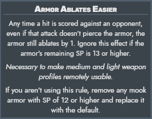
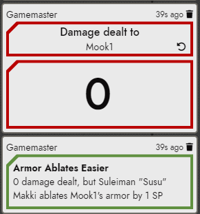

# Cyerbpunk Red - Armor Ablates Easier

A Foundry VTT game module for Cyberpunk Red that adds the "Armor Ablates Easier" house rule. This rule was introduced in the Foundry VTT module "Night City Gang and Corp Mook Pack" and is used in the Foundry VTT campaign module "Ticket To the Afterlife", both by TheInvaderZim. Neither of these modules are required for this module to work, but they can be found here:

[Night City Gang and Corp Mook Pack](https://github.com/TheInvaderZim/night-city-gang-and-corp-mook-pack)

[Ticket To The Afterlife](https://github.com/TheInvaderZim/Ticket-To-The-Afterlife/)

## Requirements

[FoundryVTT](https://foundryvtt.com)

[Cyberpunk Red - Core game system ](https://foundryvtt.com/packages/cyberpunk-red-core)

## How it works

This module implements the following house rule:

The house rule is disabled by default, so the gamemaster will be required to turn it on in the module settings. Once enabled, anytime 0 damage is dealt to a player/mook and the defender's armor SP rating is below the configured threshold (default 13), armor is automatically ablated. It outputs a chat message.

